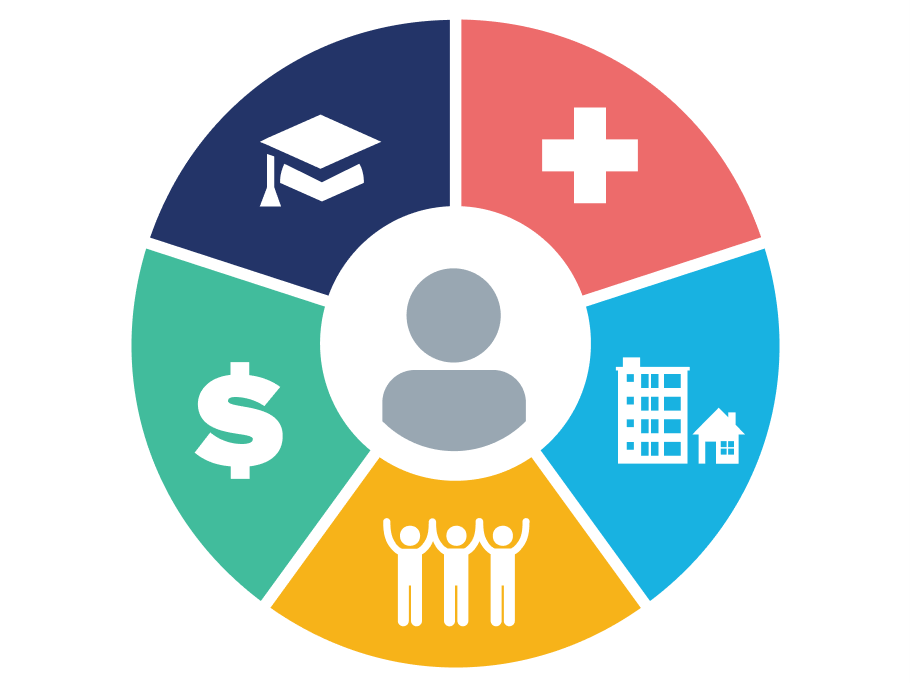

# UT-VIRT-DATA-Group-6-Project

### Project Overview
In segment one we'll complete the following tasks:
- Create the foundation for the final project and - importantly - decide on a topic/question that can be answered using data
- Define roles between team members and establish a team communication structure
- Source a dataset, and begin to clean, organize, and perform exploratory data analysis
- Create mockups of a machine learning model, a database, and a firm grasp of how you want these different pieces to interact

### Introduction
For our final project, we'll source a dataset from the US Census Bureau API. This dataset will include individual demographic information - such as age, gender and race - as well as education level and salary. Our machine learning model will predict whether an individual is likely to earn a yearly income below a certain threshold. Then we'll provide resources to help individuals reach their career and life goals.

