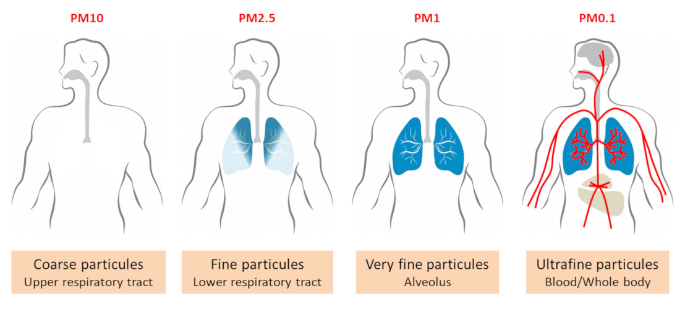
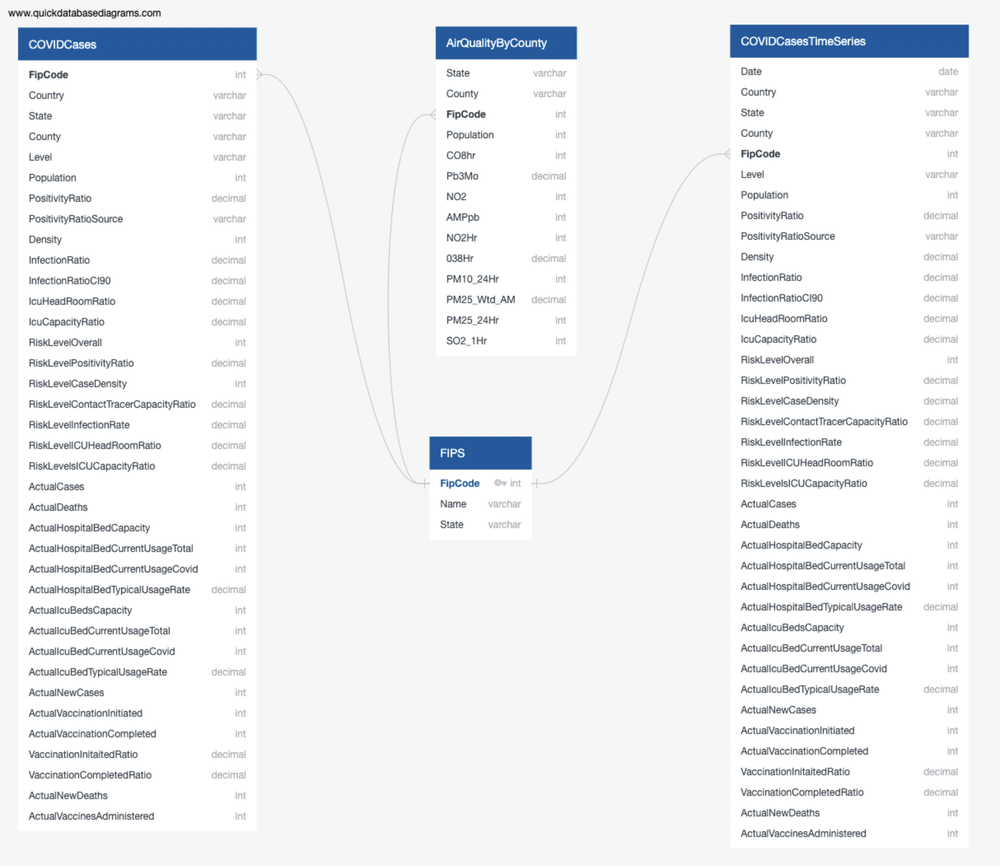

# UT-VIRT-DATA-GROUP-6-PROJECT

### Purpose

1. GitHub
    - Main Branch
    - README.md
        - Description of the communication protocols:
            As a virtual team, we share the same goal - but we have different obligations and responsibilities outside of this project.               In order to reach our goal, we will communicate through Slack and work concurrently via Github. Group members are expected to             meet on Monday and Wednesday nights, communicate regularly, do their best to acheive goals, and reach out if issues arise.
        - Presentation
            - Select a topic:
                project topic:Particulate Matter and Hospitalizations and Death Rates due to COVID-19
                
            - Reason why we selected the topic:
                - We would like to know whether there is a strong relation between exposure to PM, which could increase the susceptibility and severity of the COVID-19 patient symptoms, and hospitalizations and deaths rates due to COVID-19.
                - Availablity of COVID-19 and quality of air data for different counties.
                - An opportunity to apply the skills learned throughout this Boot Camp program.
            - Description of the source of our data:our data sources include:
                - United States Environmental Protecton Agency (EPA): the AirData Air   Quality Index Summary report provides an annual summary of air quality index values, which represent the quality of air in counties. However, not all places have air quality monitoring systems in place.

                - covidactnow.org:
                 The Covid Act Now API provides access to all of our COVID data tracking US states, counties, and metros.It includes data and metrics for cases, vaccinations, tests, hospitalizations, and deaths. 

            - Questions we hope to answer with the data
                - Is there a strong relation between exposure to PM, which could increase the susceptibility and severity of the COVID-19 patient symptoms, and hospitalizations and deaths rates due to COVID-19?

                - Can this relation be modeled and then use to predict number of hopitalizations and possible deaths that could result from exposure to particulates matter?

    - Individual Branches

2. Machine Learning Model(see Covid_PM_Model.ipynb for basic script outline): a machine learning model that retrieves data from a database and outputs label(s) for input data. We will use logistic regression to predict a binary outcome - two possible outcomes - hospitalizations and deaths rates. We'll take the following steps to use a logistic regression model:

- Create a model with LogisticRegression().
- Train the model with model.fit().
- Make predictions with model.predict().
- Validate the model with accuracy_score().

3. Database: a database that represent the final database structure and allows a drafted machine learning model to be connected.

### Database Design

